# Fluxograma
## Questão 1
### Calcule a média de 4 números inteiros dados
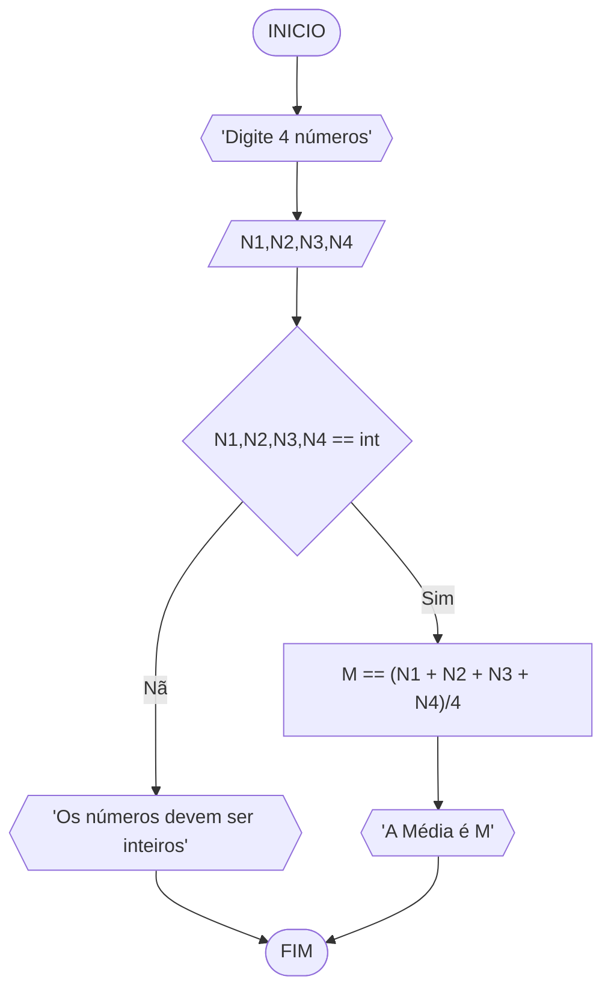
```mermaid
flowchart TD
A([INICIO]) --> B{{'Digite 4 números'}}
B --> C[/N1,N2,N3,N4/]
C --> D{N1,N2,N3,N4 == int}
D --Sim--> E["M == (N1 + N2 + N3 + N4)/4"]
E --> G{{'A Média é M'}}
D --Não--> F{{'Os números devem ser inteiros'}} 
F --> Z([FIM])
G --> Z

```
## Questão 2
### Leia uma temperatura dada na escala Celsius (C) e imprima o equivalente em Fahrenheit
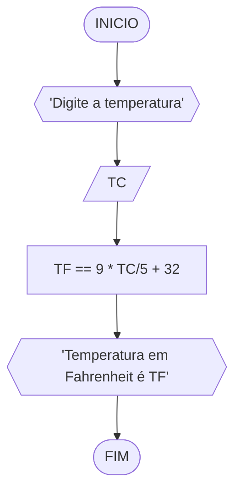
```mermaid
flowchart TD
A([INICIO]) --> B{{'Digite a temperatura'}}
B --> C[/TC/] 
C --> E[TF == 9 * TC/5 + 32] 
E --> F{{'Temperatura em Fahrenheit é TF'}}
F --> Z
Z([FIM])
```
## Questão 3
### Leia uma quantidade de chuva dada em polegadas e imprima o equivalente em milímetros
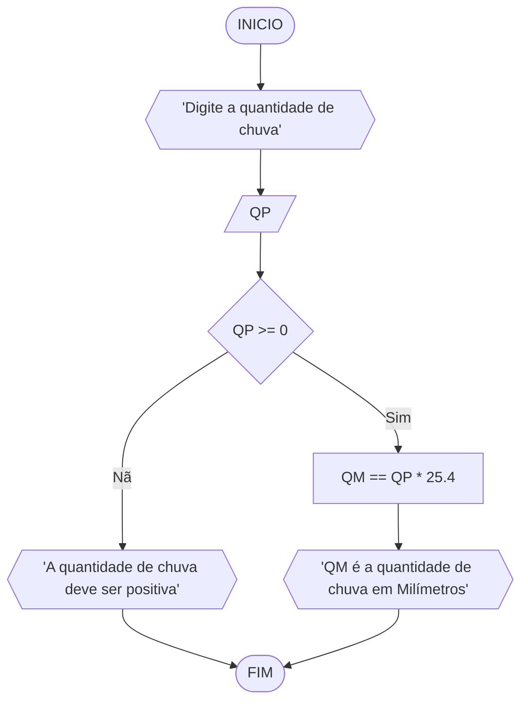
```mermaid
flowchart TD
A([INICIO]) --> B{{'Digite a quantidade de chuva'}}
B --> C[/QP/]
C --> D{QP >= 0}
D --Sim--> E[QM == QP * 25.4]
D --Não--> G{{'A quantidade de chuva deve ser positiva'}}
G --> Z([FIM])
E --> F{{'QM é a quantidade de chuva em Milímetros'}}
F --> Z
```
## Questão 4
### Leia o custo de fábrica do carro e imprimir o custo ao consumidor 
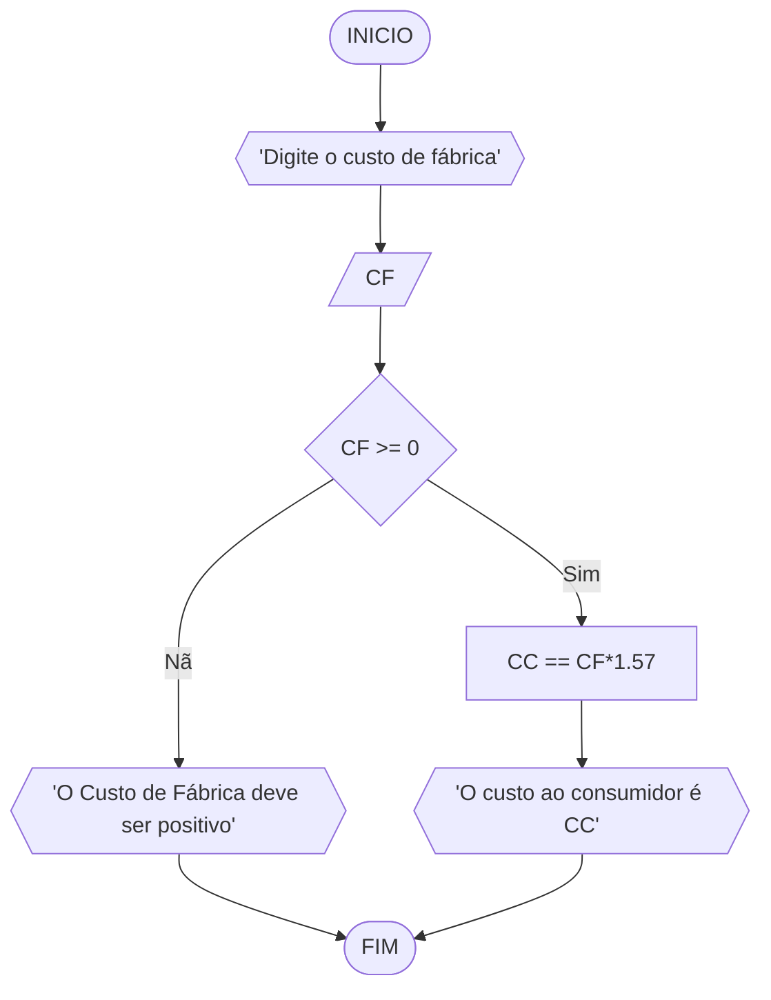
```mermaid
flowchart TD
A([INICIO]) --> B{{'Digite o custo de fábrica'}}
B --> C[/CF/]
C --> F{CF >= 0}
F --Sim--> D[CC == CF*1.57] 
D --> E{{'O custo ao consumidor é CC'}}
F --Não--> G{{'O Custo de Fábrica deve ser positivo'}}
G --> Z([FIM])
E --> Z
```
## Questão 5
### Calcule o quadrado de um número
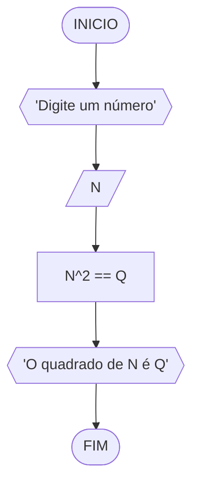
```mermaid
flowchart TD
A([INICIO]) --> B{{'Digite um número'}}
B --> C[/N/]
C --> D[N^2 == Q]
D --> E{{'O quadrado de N é Q'}}
E --> Z([FIM])
```
## Questão 6
### Leia a quantidade de cada item no cardápio consumido e calcule a conta final
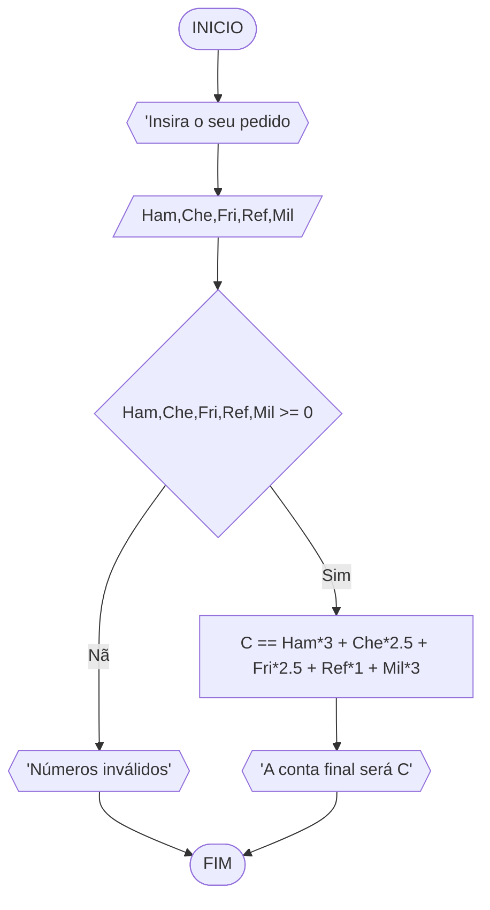
```mermaid
flowchart TD
A([INICIO]) --> B{{'Insira o seu pedido}}
B --> C[/Ham,Che,Fri,Ref,Mil/]
C --> F{Ham,Che,Fri,Ref,Mil >= 0}
F --Não--> X{{'Números inválidos'}} --> Z
F --Sim--> D[C == Ham*3 + Che*2.5 + Fri*2.5 + Ref*1 + Mil*3]
D --> E{{'A conta final será C'}}
E --> Z([FIM])
```
## Questão 7
### Calcule e imprima o salário do vendedor de uma companhia de carros num mês
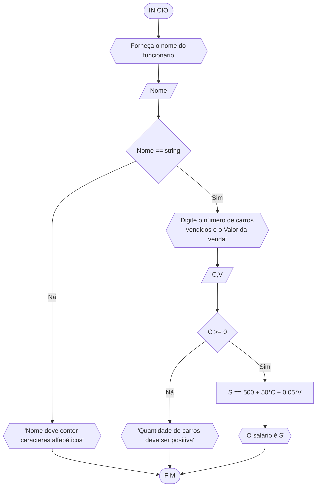
```mermaid
flowchart TD
A([INICIO]) --> B{{'Forneça o nome do funcionário}}
B --> C[/Nome/]
C --> F{Nome == string}
F --Sim--> D{{'Digite o número de carros vendidos e o Valor da venda'}}
F --Não--> G{{'Nome deve conter caracteres alfabéticos'}}
G --> Z([FIM])
D --> E[/C,V/]
E --> H{C >= 0}
H --Sim--> I[S == 500 + 50*C + 0.05*V] 
H --Não--> J{{'Quantidade de carros deve ser positiva'}}
J --> Z
I --> K{{'O salário é S'}}
K --> Z([FIM])
```
## Questão 8
### Calcule a média de um aluno na disciplina de RLA. Solicite o nome do aluno, a nota da prova e a nota qualitativa. 
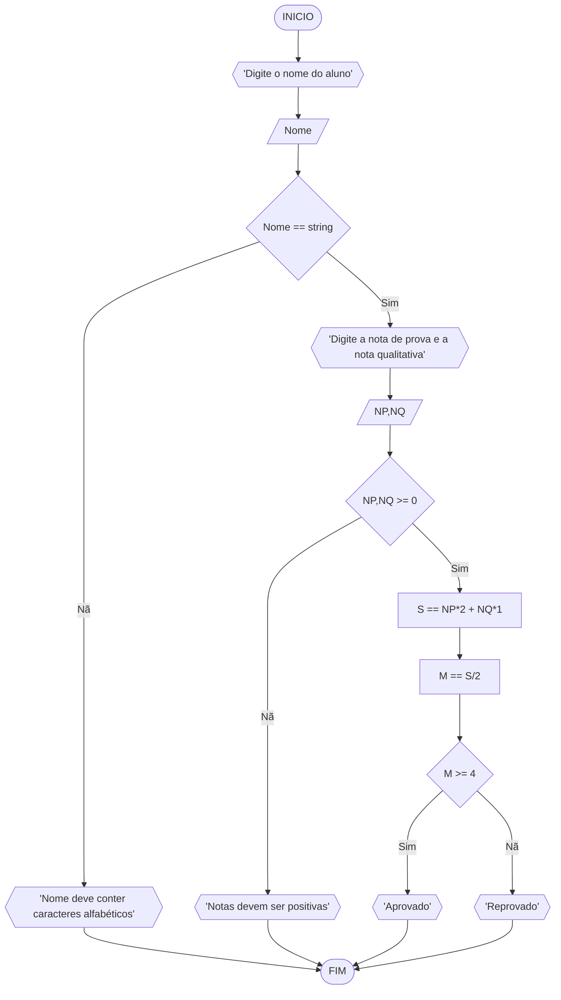
```mermaid
flowchart TD
A([INICIO]) --> B{{'Digite o nome do aluno'}}
B --> C[/Nome/]
C --> D{Nome == string}
D --Sim--> E{{'Digite a nota de prova e a nota qualitativa'}}
D --Não--> F{{'Nome deve conter caracteres alfabéticos'}}
F --> Z([FIM])
E --> G[/NP,NQ/]
G --> H{NP,NQ >= 0}
H --Sim--> I[S == NP*2 + NQ*1] 
I --> K[M == S/2]
H --Não--> J{{'Notas devem ser positivas'}}
J --> Z
K --> L{M >= 4}
L --Sim--> M{{'Aprovado'}}
L --Não--> N{{'Reprovado'}}
M --> Z
N --> Z
```
## Questão 9
### Imprima os dados de um usuário como uma ficha preenchida de um estudante. (nome, matrícula, curso, idade, email)
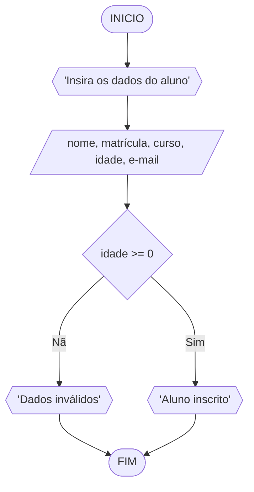
```mermaid
flowchart TD
A([INICIO]) --> B{{'Insira os dados do aluno'}}
B --> C[/nome, matrícula, curso, idade, e-mail/]
C --> D{idade >= 0}
D --Sim--> E{{'Aluno inscrito'}}
D --Não--> F{{'Dados inválidos'}}
F --> Z([FIM])
E --> Z
```
## Questão 10
### Calcule e mostre a área e o perímetro de um cubo
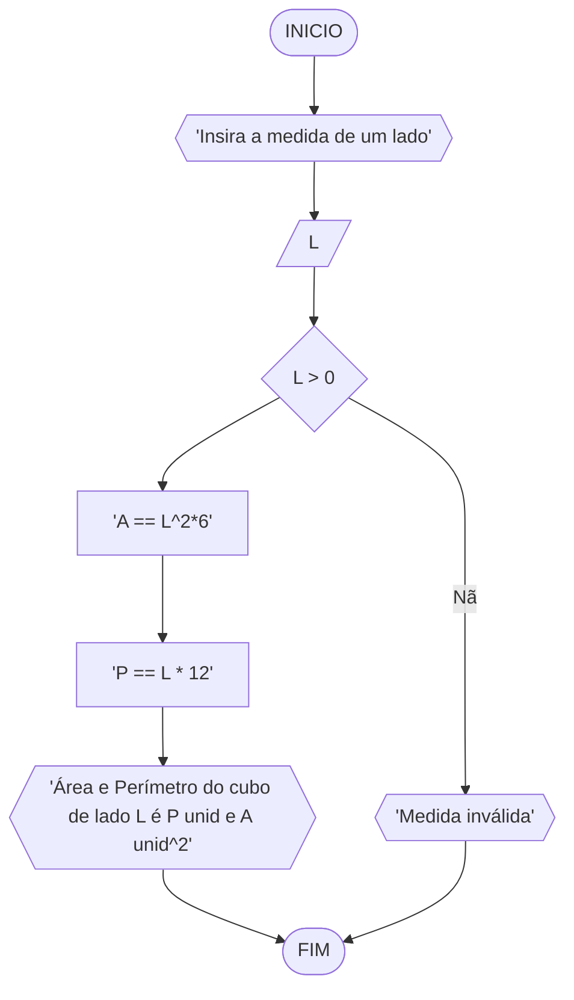
```mermaid
flowchart TD
A([INICIO]) --> B{{'Insira a medida de um lado'}}
B --> C[/L/]
C --> D{L > 0}
D --> E['A == L^2*6']
E --> G['P == L * 12']
G --> Y{{'Área e Perímetro do cubo de lado L é P unid e A unid^2'}}
Y --> Z([FIM])
D --Não--> F{{'Medida inválida'}}
F --> Z
```
## Questão 11
### Programa que receba um número positivo e maior que zero, calcule e mostre: número digitado ao quadrado, digitado ao cubo, raiz quadrada do número, raiz cúbica do número 
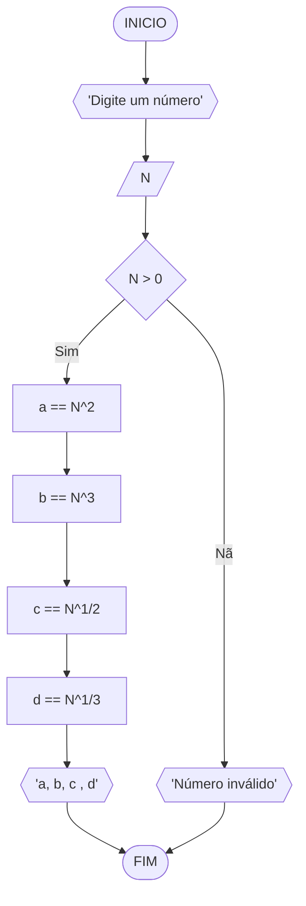
```mermaid
flowchart TD
A([INICIO]) --> B{{'Digite um número'}}
B --> C[/N/]
C --> D{N > 0}
D --Sim--> E[a == N^2]
E --> G[b == N^3]
G --> H[c == N^1/2]
H --> I[d == N^1/3]
I --> J{{'a, b, c , d'}}
J --> Z
D --Não--> F{{'Número inválido'}}
F --> Z([FIM])
```
## Questão 12
### Algoritmo que lê três números inteiros e mostra-os em ordem crescente
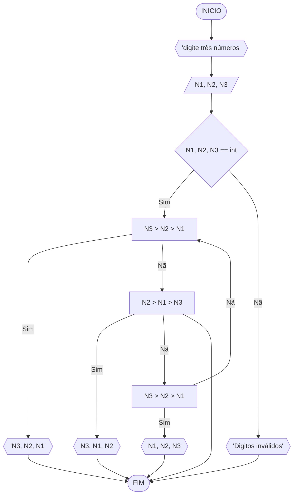
```mermaid
flowchart TD
A([INICIO]) --> B{{'digite três números'}}
B --> C[/N1, N2, N3/]
C --> D{N1, N2, N3 == int}
D --Sim--> E[N1 > N2 > N3]
D --Não--> F{{'Digitos inválidos'}}
E --Sim--> H{{'N3, N2, N1'}}
E --Não--> G[N2 > N1 > N3]
G --Sim--> I{{N3, N1, N2}}
G --Não--> J[N3 > N2 > N1]
J --Não--> E[N3 > N2 > N1]
J --Sim--> K{{N1, N2, N3}}

F --> Z([FIM])
G --> Z([FIM])
H --> Z([FIM])
K --> Z([FIM])
I --> Z([FIM])
```
## Questão 13
### Classificação de categorias com base na idade de um nadador
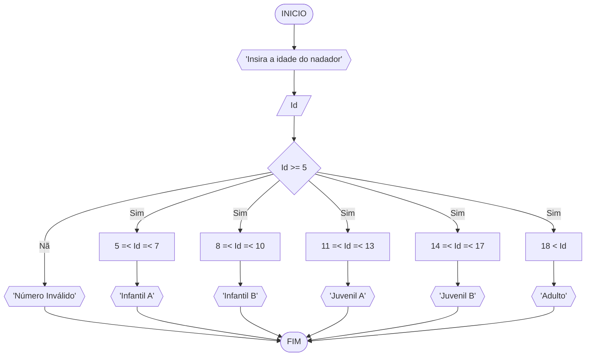
```mermaid
flowchart TD
A([INICIO]) --> B{{'Insira a idade do nadador'}}
B --> C[/Id/]
C --> D{Id >= 5}
D --Sim--> E[5 =< Id =< 7]
D --Não--> P{{'Número Inválido'}}
E --> F{{'Infantil A'}}
D --Sim--> G[8 =< Id =< 10] 
G --> K{{'Infantil B'}}
D --Sim--> H[11 =< Id =< 13]
H --> L{{'Juvenil A'}}
D --Sim--> I[14 =< Id =< 17]
I --> M{{'Juvenil B'}}
D --Sim--> J[18 < Id]
J --> N{{'Adulto'}}
P --> Z([FIM])
F --> Z([FIM])
K --> Z([FIM])
L --> Z([FIM])
M --> Z([FIM])
N --> Z([FIM])
```
## Questão 14
### Dado três números inteiros, algoritmo para retornar o menor deles
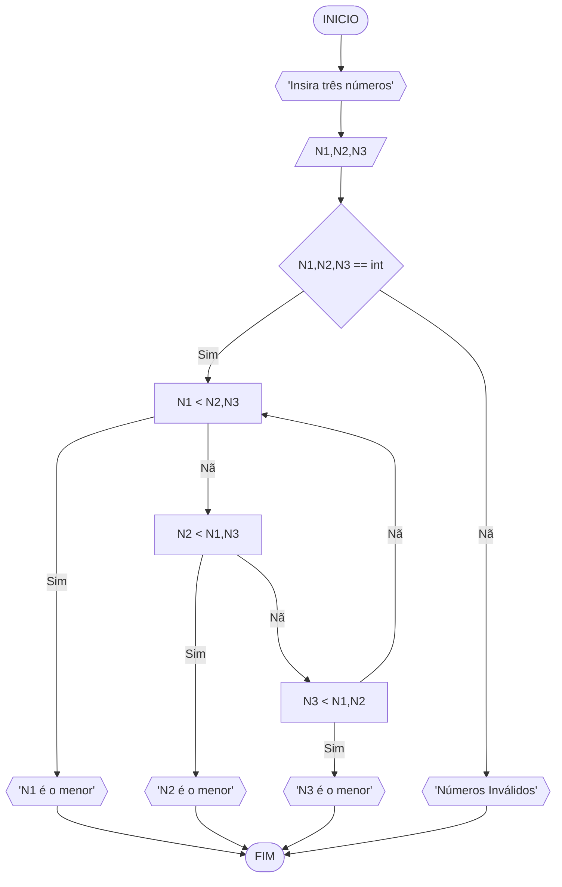
```mermaid
flowchart TD
A([INICIO]) --> B{{'Insira três números'}}
B --> C[/N1,N2,N3/]
C --> D{N1,N2,N3 == int}
D --Sim--> E[N1 < N2,N3]
E --Sim--> G{{'N1 é o menor'}}
E --Não--> H[N2 < N1,N3]
H --Sim--> J{{'N2 é o menor'}}
H --Não--> I[N3 < N1,N2]
I --Sim--> K{{'N3 é o menor'}}
I --Não--> E
G --> Z
J --> Z
K --> Z
D --Não--> F{{'Números Inválidos'}}
F --> Z([FIM])
```
## Questão 15
### Algoritmo de conversão de peso em libras para quilogramas
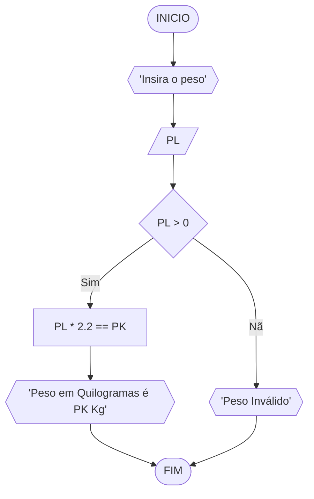
```mermaid
flowchart TD
A([INICIO]) --> B{{'Insira o peso'}}
B --> C[/PL/]
C --> D{PL > 0}
D --Sim--> E[PL * 2.2 == PK]
E --> G{{'Peso em Quilogramas é PK Kg'}}
G --> Z
D --Não--> F{{'Peso Inválido'}}
F --> Z([FIM])
```
## Questão 16
### Status de um aluno com base em sua média
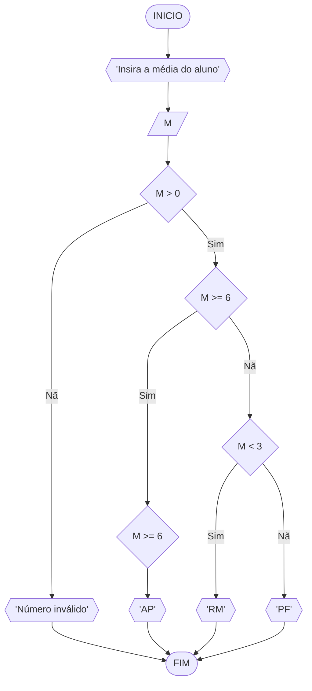
```mermaid
flowchart TD
A([INICIO]) --> B{{'Insira a média do aluno'}}
B --> C[/M/]
C --> D{M > 0}
D --Sim--> E{M >= 6}
D --Não--> F{{'Número inválido'}}
E --Sim--> G{M >= 6}
G --> K{{'AP'}}
E --Não--> H{M < 3}
H --Sim--> I{{'RM'}}
H --Não--> J{{'PF'}}
F --> Z([FIM])
K --> Z([FIM])
I --> Z([FIM])
J --> Z([FIM])
```
## Questão 17
### Calculo de Salário Líquido
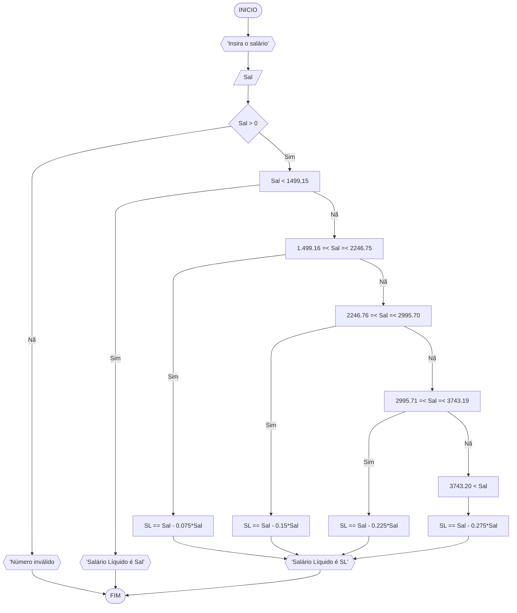
```mermaid
flowchart TD
A([INICIO]) --> B{{'Insira o salário'}}
B --> C[/Sal/]
C --> D{Sal > 0}
D --Não--> E{{'Número inválido}}
D --Sim--> F[Sal < 1499,15]
F --Sim--> G{{'Salário Líquido é Sal'}}
F --Não--> H[1.499.16 =< Sal =< 2246.75]
H --Sim--> 3[SL == Sal - 0.075*Sal]
3 --> P
H --Não--> K[2246.76 =< Sal =< 2995.70]
K --Sim--> W[SL == Sal - 0.15*Sal]
W --> P
K --Não--> L[2995.71 =< Sal =< 3743.19]
L --Sim--> R[SL == Sal - 0.225*Sal]
R --> P{{'Salário Líquido é SL'}}
L --Não--> M[3743.20 < Sal]
M --> I[SL == Sal - 0.275*Sal]
I --> P
G --> Z([FIM])
E --> Z
P --> Z
```
## Questão 18
### Conversão de critério de avaliação de alunos de escolas brasileiras para o critério utilizado em escolas americanas
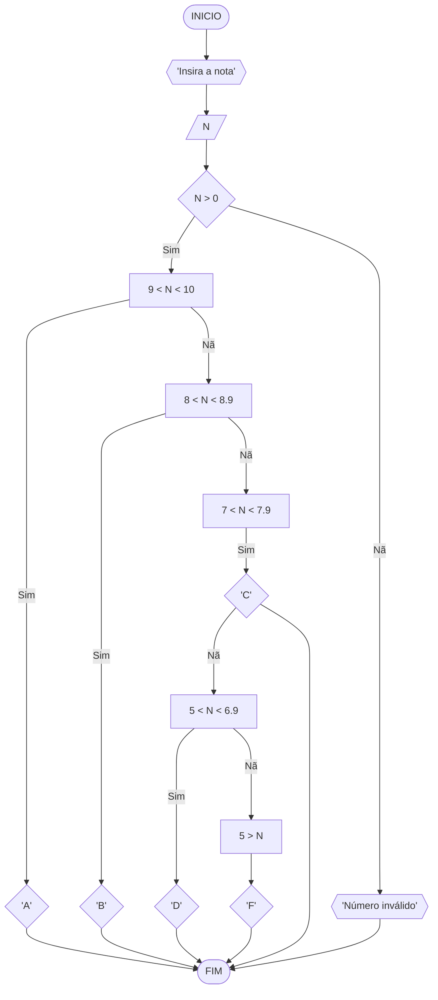
```mermaid
flowchart TD
A([INICIO]) --> B{{'Insira a nota'}}
B --> C[/N/]
C --> D{N > 0}
D --Sim--> E[9 < N < 10]
E --Sim--> G{'A'}
E --Não--> H[8 < N < 8.9]
H --Sim--> I{'B'}
H --Não--> J[7 < N < 7.9]
J --Sim--> K{'C'}
K --Não--> L[5 < N < 6.9]
L --Sim--> M{'D'}
L --Não--> N[5 > N]
N --> O{'F'}
D --Não--> F{{'Número inválido'}}
F --> Z([FIM])
G --> Z
K --> Z
I --> Z
M --> Z
O --> Z
```
## Questão 19
### Determinar se um número é nulo, positivo ou negativo
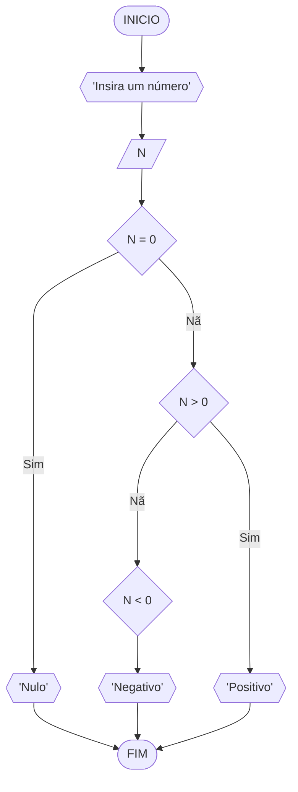
```mermaid
flowchart TD
A([INICIO]) --> B{{'Insira um número'}}
B --> C[/N/]
C --> D{N = 0}
D --Sim--> E{{'Nulo'}}
D --Não--> F{N > 0}
F --Sim--> G{{'Positivo'}}
F --Não--> H{N < 0}
H --> I{{'Negativo'}}
E --> Z([FIM])
I --> Z([FIM])
G --> Z([FIM])
```
## Questão 20
### Simulador de operações de uma calculadora simples
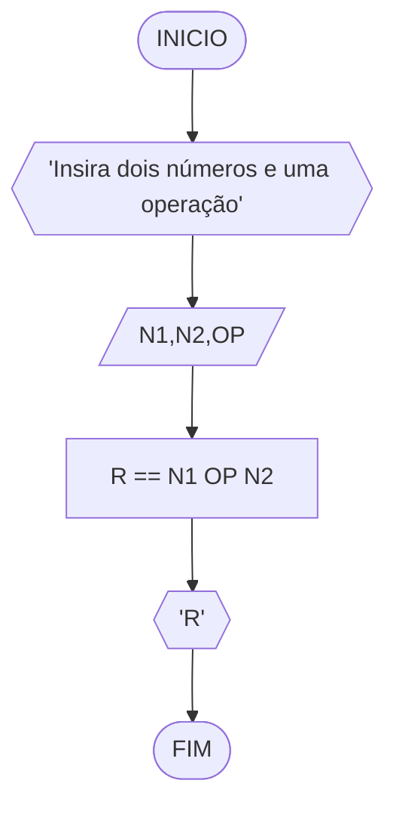
```mermaid
flowchart TD
A([INICIO]) --> B{{'Insira dois números e uma operação'}}
B --> C[/N1,N2,OP/]
C --> D[R == N1 OP N2]
D --> E{{'R'}}   
E --> Z([FIM])
```
