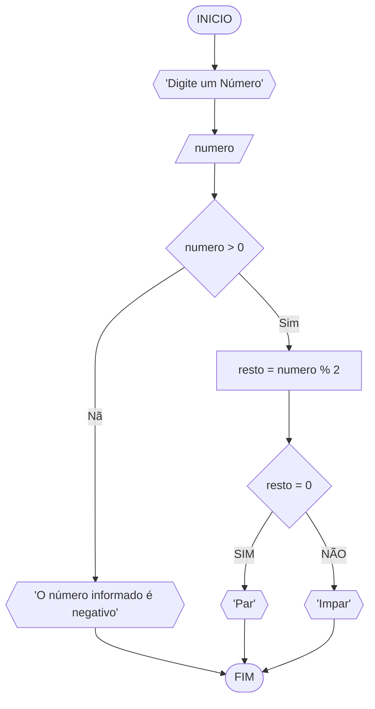

# Unifor 
**Disciplina:** Raciocínio Lógico Algorítmico
**Orientador:** Prof. Ricardo Carubbi

## Lista de Exercícios
### Exercício 3
Represente, em fluxograma e pseudocódigo, em algoritmo para determinar se um número inteiro e positivo é par ou impar

#### Fluxograma

#### Pseudocódigo
```
1  ALGORITMO verifica_par_impar
2  DECLARE numero, resto NUMERICO
3  ESCREVA "Digite um número:"
4  LEIA numero
5  SE numero > 0 ENTAO
6      resto = numero % 2
7      SE resto = 0 ENTAO
8          ESCREVA "par"
9      SENAO
10         ESCREVA "impar"
11 SENAO
12     ESCREVA "O Número é Negativo"
13 FIM_ALGORITMO 
```
