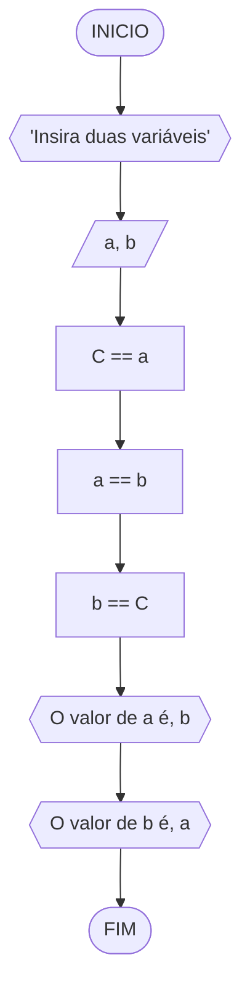
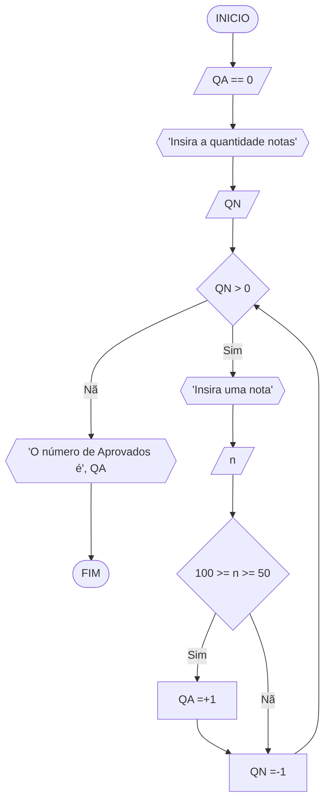
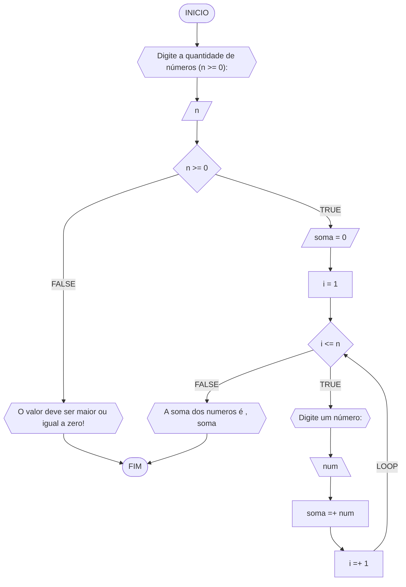
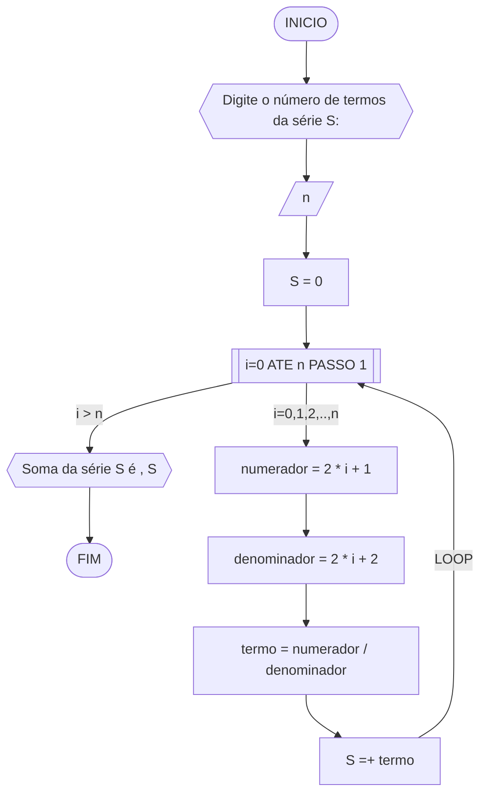
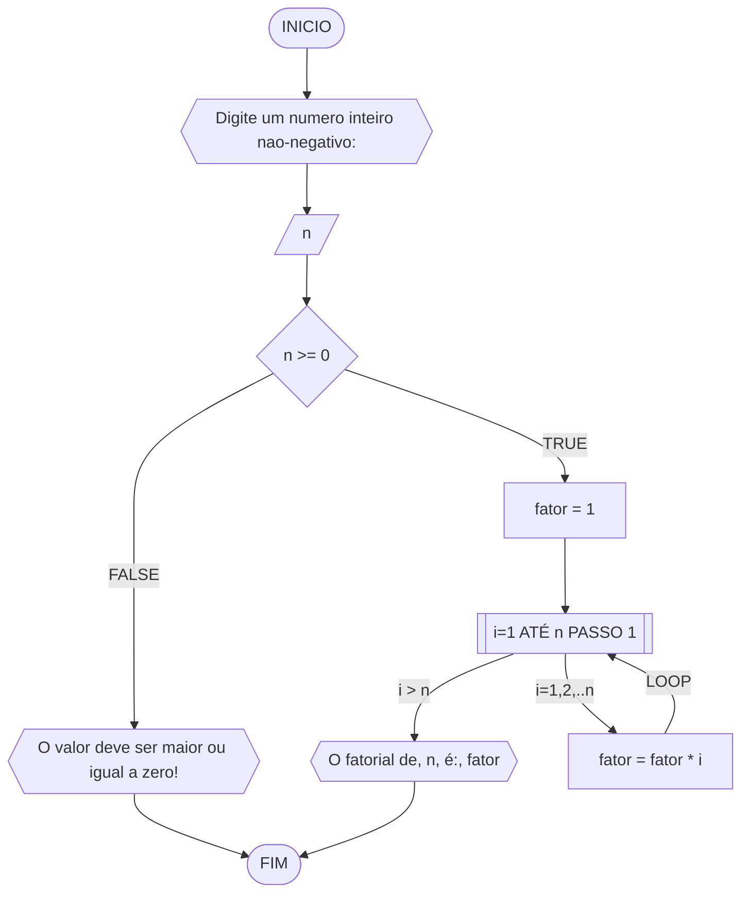
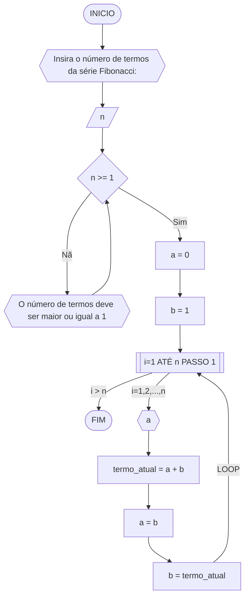
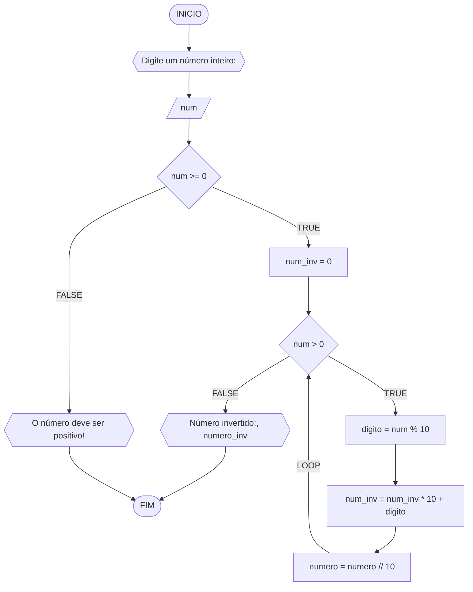

**Curso:** Engenharia Elétrica <br>
**Disciplina:** Raciocínio Lógico e Algoritmo <br>
**Código/Turma:** T998-31 <br>
**Professor:** Ricardo Carubbi <br>
**Data:** 20/03/2024 <br>
**Aluno(a):** Pedro Lucas Fernandes Moura <br>
**Matrícula:** 2410676 <br>

**1a chamada (Sim/Não):** Sim <br>
**2a chamada (Sim/Não):** Não

# Avaliação Diagnóstica 1

## Normas e exigências

Avaliação diagnóstica (**AD**) consiste em exercícios ou projetos desenvolvidos em grupo ao longo da disciplina. <br>
A primeira avaliação diagnóstica (**AD1**) será composta por exercícios e equivale a 30% da nota da primeira avaliação (**AV1**).

Segue abaixo a expressão para o cálculo da **AV1**, sendo sendo **AF1** equivale a primeira avaliação formativa e **AD1**, a primeira avaliação diagnóstica.

$$AV_1 = AF_1 \times 0,30 + AD_1 \times 0,70$$

A **AD1** é formada pela entrega dos exercícios (**EX1**) na data prevista e apresentação (**AP1**) de um dos exercícios escolhido pelo professor.
Segue abaixo a expressão para o cálculo da **AD1**.

$$AD_1 = (EX1_1 + AP_1)/2 $$

A **EX1** é avaliada mediante a **correção dos exercícios**, sendo a avaliação no intervalo de 0% (não atende a questão), 50% (atende parcialmente) e 100% (atende em sua totalidade).
Por exemplo, se o exercício equivale a 2 pontos e sua correção atente parcialmente a questão, então sua avaliação deste exercício será 1 ponto.

A **AP1** é avaliada mediante aos pré-requisitos de **clareza, organização e domínio do conteúdo**. Portanto, o aluno deve demonstrar um bom entendimento do algoritmo, explicando seus princípios fundamentais, seu propósito e como ele funciona passo a passo. <br>

A avaliação da **AP1** é apenas considerada no intervalo de 0% (não atende os pré-requisitos), 50% (atende parcialmente) e 100% (atende em sua totalidade).
Por exemplo, se na apresentação do exercício, o aluno atenter parcialmente os pré-requisitos, então sua avaliação da apresentação será 5,0.

## Datas
- Entrega da primeira avaliação formativa (**AF1**) composta pelas listas de exercícios 1, 2 e 3: 21/03/24
- Entrega dos exercícios da primeira avaliação diagnóstica (**EX1**): 21/03/24
- Apresentação da primeira avaliação diagnóstica (**AP1**): 21/03/24


## Lista de questões

### Questão 1 - Troca dos valores de duas variáveis (1 ponto)

Dadas duas variáveis, $a$ e $b$, implemente e teste um algoritmo para trocar os valores atribuídos a elas.

#### Descrição geral do algoritmo

1. Guardar o valor original da variável $a$ em uma variável auxiliar $aux$;
2. Atribuir à variável $a$ o valor original da variável $b$;
3. Atribuir à variável $b$ o valor original da variável $a$, que está armazenado na variável auxiliar $aux$.
4. Exibir os novos valores de $a$ e $b$.

#### Fluxograma (0.25 ponto)



#### Pseudocódigo (0.5 ponto)

```
1 ALGORITMO TrocaValores
2 DECLARE a, b
3 ESCREVA "Insira duas variáveis"
4 LEIA a, b
5 C <-- a
6 a <-- b
7 b <-- C
8 ESCREVA "O valor de a é", b
9 ESCREVA "O valor de b é", a 
10 FIM_ALGORITMO
```

#### Teste de mesa (0.25 ponto)

| a | b | C == a | a == b | b == C | Valor de a | Valor de b | 
| -- | -- | -- | -- | -- | -- | -- |
| 1 | 2 | C == 1 | a == 2 | b == 1| 1 | 2 | 
| -3 | 6 | C == -3 | a == 6 | b == -3| 6 | -3 |
| -1 | -20 | C == -1 | a == -20 | b == -1| -20 | -1 |

### Questão 2 - Contagem (1 ponto)

Dado um conjunto $n$ de notas de alunos em um exame, implemente e teste um algoritmo para fazer uma contagem $cont$ do número de alunos que foram aprovados no exame. 
Será considerado aprovado o aluno que tirar $nota$ 50 ou maior (no intervalo de 0 a 100).

#### Descrição geral do algoritmo

1. Obter o número de notas $n$ a serem processadas;
2. Inicializar a contagem $cont$ com zero;
3. Enquanto houver notas a serem processadas, fazer repetidamente:
    - obter a próxima nota;
    - se a nota for suficiente para passar no exame ($n ≥ 50$) então adicionar 1 (um) à contagem $cont$;
4. Exibir a contagem $cont$ (número total de aprovações).

#### Fluxograma (0.25 ponto)



#### Pseudocódigo (0.5 ponto)

```
1 ALGORITMO ContaAprovacoes
2 DECLARE n, QA, QN
3 INICIO
4 ESCREVA "Insira a quantidade notas"
5 LEIA QN
6 QA <-- 0
7 ENQUANTO QN > 0 FAÇA
8   ESCREVA "Insira uma nota"
9   LEIA n
10   SE n >= 50 ENTAO
11     QA =+1
12     QN =-1
13   SENAO
14     QN =-1
15 FIM_ENQUANTO
16 ESCREVA "A quantidade de aprovados é", QA
17 FIM_ALGORITMO
```

#### Teste de mesa (0.25 ponto)

| QN | QN > 0 | "O número de aprovados é", QA | n | n válida | QA =+1 | QN =-1 |  
| -- | -- | -- | -- | -- | -- | -- | 
| 3 | Verdade | 0 | 50 | Verdade | 1 | 2 | 
| 2 | Verdade | 1 | 67 | Verdade | 2 | 1 |
| 1 | Verdade | 2 | 23 | Falso | -- | 0 |
| 0 | Falso | 2 | -- | -- | -- | -- |


### Questão 3 - Soma de um conjunto de números (1 ponto)

Dado um conjunto de $n$ números, implemente e teste um algoritmo para calcular a soma desses números. <br>
Aceite apenas $n$ maior ou igual a zero.

#### Descrição geral do algoritmo

1. Obter a quantidade de números $n$ a serem somados.
2. Inicializar a variável $soma$ com 0 (zero).
3. Enquanto menos do que $n$ números tiverem sido somados, fazer repetidamente:
    - obter o próximo número $i$;
    - calcular a soma atual, adicionando o número $i$ obtido à soma  mais recente;
4. Exibir a soma dos $n$ números

#### Fluxograma



#### Pseudocódigo (1 ponto)

```
1 ALGORITMO SomaNumeros
2 DECLARE n, i, soma, num 
3 INICIO
4 ESCREVA "Digite a quantidade de números"
5 LEIA n
6 SE n >= 0 ENTAO
7   soma = 0
8   PARA i de 1 até n PASSO 1 FAÇA
9       ESCREVA "Digite um número"
10      LEIA num
11      soma =+ num
12      i =+ 1
13  FIM_PARA
14  ESCREVA "A soma dos números é ", soma
15 SENAO
16   ESCREVA "O valor deve ser maior ou igual a zero!"
17 FIM_SE
18 FIM_ALGORITMO
...
FIM
```

#### Teste de mesa

| it | n  | n >= 0 | soma | i  | i <= n | num | soma =+ num  | saída |
| -- | -- | -- | -- | -- | -- | -- | --           | -- |
|    | -3 | Falso  |      |    |        |     |              | O valor deve ser maior ou igual a zero! |
| 1  | 0  | Verdade   | 0    | 1  | Falso  |     |              | A soma dos números é 0  |
| 1  | 3  | Verdade   | 0    | 1  | Verdade   | 5   | 0 + 5 = 5    |                         |
| 2  | 3  | Verdade | 5    | 2  | Verdade   | 10  | 5 + 10 = 15  |                         |
| 3  | 3  | Verdade   | 15   | 3  | Verdade  | 20  | 15 + 20 = 35 |                         |
| 4  | 3  | Verdade   | 35   | 4  | Falso  |     |              | A soma dos números é 35 |

### Questão 4 - Cálculo de uma série (1 ponto)

Dado um conjunto de $n$ termos da série, implemente e teste um algoritmo para calcular o valor de S, conforme definido abaixo:

$$ S = \frac{1}{2} + \frac{3}{4} + \frac{5}{6} + \frac{7}{8} + \dots $$

#### Descrição geral do algoritmo

1. Obter o número de termos $n$;
2. Inicializar a variável $S$ com 0 (zero).
3. Iterar o valor de $n$ na variável $i$ iniciando com 0 (zero), de acordo com as instruções abaixo:
    - calcular o numerador na variável $numerador$;
    - calcular o denominador  na variável $denominador$;;
    - calcular o termo da série na variável $termo$, onde $termo = numerador/denominador$;
    - adicionar esse termo à variável $S$.
4. Exibir o valor da série $S$.

#### Fluxograma



#### Pseudocódigo (1 ponto)

```
1 ALGORITMO SomaSerie
2 DECLARE n, S, i, termo, numerador, denominador 
3 INICIO
4 ESCREVA "Digite o número de termos da série S: "
5 LEIA n
6 S = 0
7 PARA i DE 0 ATE n PASSO 1 FAÇA
8     numerador = 2 * i + 1
9     denominador = 2 * i + 2
10    termo = numerador / denominador
11    S =+ termo
12 FIM_PARA
13 ESCREVA "Soma da série S é ", S
14 FIM_ALGORITMO  
...
FIM
```

#### Teste de mesa (0.25 ponto)

| it | n  | S  | i | numerador | denominador | termo | S += termo     | saída                  |
| -- | -- | -- |-- | --        | --          | --    | --             | --                     |
|    | 0  | 0  |   |           |             |       |                |                        |
| 1  | 4  | 0  | 0 | 2*0+1 = 1 | 2*0+2 = 2   | 1/2   | 0+1/2 = 1/2    |                        |
| 2  | 4  | 0  | 1 | 2*1+1 = 1 | 2*1+2 = 2   | 3/4   | 1/2+3/4 = 1.25 |                        |
| 3  | 4  | 0  | 2 | 2*2+1 = 1 | 2*2+2 = 2   | 5/6   | 5/4+5/6 = 2.08   |                        |
| 4  | 4  | 0  | 3 | 2*3+1 = 1 | 2*3+2 = 2   | 7/8   | 5/6+7/8 = 2.96   | Soma da série S é 2.96 |

### Questão 5 - Cálculo fatorial (2 pontos)

Dado um número $n$, implemente e teste um algoritmo para calcular o fatorial de $n$ (escrito como $n!$), onde $n ≥ 0$.

#### Descrição geral do algoritmo

1. Obter o número $n$, onde $n \geq 0$;
2. Inicializar a variável $fator$ com 1 (um) para armazenar o resultado do cálculo do fatorial;
3. Iterar o valor de $n$ na variável $i$, ou seja, executar $n$ vezes, as instruções abaixo:
    - Incrementar o valor atual $fator$ multiplicando pelo valor de $i$;
4. Exibir o resultado ($n!$).

#### Fluxograma



#### Pseudocódigo (2 pontos)

```
1 ALGORITMO CalcFatorial
2 DECLARE n, fator, i
3 INICIO
4 ESCREVA "Digite um numero inteiro nao-negativo:"
5 LEIA n
6 SE n >= 0 ENTAO
7   fator = 1
8   PARA i DE 1 ATÉ n PASSO 1
9       fator = fator * i
10  FIM_PARA
11  ESCREVA "O fatorial de ", n," é: ", fator
12 SENAO 
13   ESCREVA "O valor deve ser maior ou igual a zero!"
14 FIM_SE
15 FIM_ALGORITMO
...
FIM
```

#### Teste de mesa

| n | fator | i | fator = fator * i | saída |
| -- | -- | -- | -- | -- |
| 3 | 1 | 1 | 1*1 = 1 |                     |
| 3 | 1 | 2 | 1*2 = 2 |                     |
| 3 | 2 | 3 | 2*3 = 6 | O fatorial de 3 é 6 |

### Questão 6 - Geração da sequência de Fibonacci (2 pontos)

Gerar e imprimir os $n$ primeiros termos da sequência de Fibonacci, onde $n ≥ 1$. <br>
Os primeiros termos são: $0, 1, 1, 2, 3, 5, 8, 13, \dots$. Cada termo, além dos dois primeiros, é derivado da soma dos seus dois antecessores mais próximos.

#### Descrição geral do algoritmo

1. Obter o número de termos $n$, onde $n \geq 1$;
2. Inicializar os dois primeiros termos da série nas variáveis $a$ e $b$ com 0 (zero);
3. Iterar o valor de $n$, ou seja, executar $n$ vezes, as instruções abaixo:
    - Imprimir o termo inicial $a$ (instrução para exibir a sequência ao atualizar a variável $a$);
    - Somar os termos $a$ e $b$ na variável $termo_atual$;
    - Atribuir a variável $a$ o valor da variável $b$;
    - Atribuir a variável $b$ o valor da variável $termo_atual$.

#### Fluxograma



#### Pseudocódigo (2 pontos)

```
1 ALGORITMO GeraFibonacci
2 DECLARE n, a, b, i, ta
3 INICIO
4 ESCREVA "Insira o número de termos da série Fibonacci:"
5 LEIA n 
6 SE n >= 1
7   a = 0
8   b = 1  
9   PARA i DE 1 ATÉ n PASSO 1
10    ESCREVA a
11    ta = a + b
12    b = ta
13  FIM_PARA
14 SENAO
15   ESCREVA "O número de termos deve ser maior ou igual a 1"
16 FIM_SE 
17 FIM_ALGORITMO
...
FIM
```
#### Teste de mesa

| it | n  | a  | b  | i  | saída | termo_atual = a + b | a = b | b = termo_atual |
| -- | -- | -- | -- | -- | -- | -- | -- | -- |
| 1 | 5 | 0 | 1 | 1  | 0 | 0 + 1 = 1 | 1 | 1 |
| 2 | 5 | 1 | 1 | 2  | 1 | 1 + 1 = 2 | 1 | 2 |
| 3 | 5 | 1 | 2 | 3  | 1 | 1 + 2 = 3 | 2 | 3 |
| 4 | 5 | 2 | 3 | 4  | 2 | 2 + 3 = 5 | 3 | 5 |
| 4 | 5 | 3 | 5 | 5  | 3 | 3 + 5 = 8 | 5 | 8 |

### Questão 7 - Inversão dos dígitos de um número inteiro (2 pontos)

Implemente e teste um algoritmo para inverter a ordem dos dígitos de um número inteiro positivo.

#### Descrição geral do algoritmo

1. Obter o número inteiro positivo $num$ a ser invertido;
2. Inicializar a variável $num \textunderscore inv$ com 0 (zero);
3. Enquanto o número for maior que zero ($num > 0$), faça repetidamente:
    - Calcular o último dígito do número na variável $digito$;
    - Adicionar o dígito ao número invertido $num \textunderscore inv$;
    - Remover o último dígito do número original $num$; 
4. Exibir o número invertido.

#### Fluxograma



#### Pseudocódigo (2 pontos)

```
1 ALGORITMO InverteInteiro
2 DECLARE num, num_inv, digito: inteiro
3 INICIO
4 ESCREVA "Digite um número inteiro:"
5 LEIA num
6 SE num >= 0
7   num_inv = 0
8   ENQUANTO num > 0 FAÇA
9     digito = num % 10
10    num_inv = num_inv * 10 + digito
11    num = num // 10
12   FIM_ENQUANTO
13   ESCREVA "Número invertido: ", num_inv
14 SENAO
15   ESCREVA "O número deve ser positivo"
16 FIM_SE
17 FIM_ALGORITMO
...
FIM
```

#### Teste de mesa

| it | num | num_inv | num > 0 | digito | num = num // 10 | num_inv = (num_inv * 10) + digito | Saída |                       
| -- | --  | -- | -- | -- | -- | -- | -- |
|    | -1  | 0       | False  |         |                 |    | O número deve ser positivo! |
| 1  | 0   | 0       | False  |         |                 |    | Número invertido:: 0        |
| 1  | 42  | 0       | True   | 2       | 4               | 2  |  |
| 2  | 4   | 2       | True   | 4       | 0               | 24 |  |
| 3  | 0   | 24      | False  |         |                 |    | Número invertido:: 24       |
