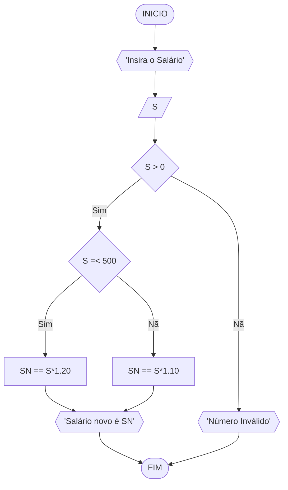
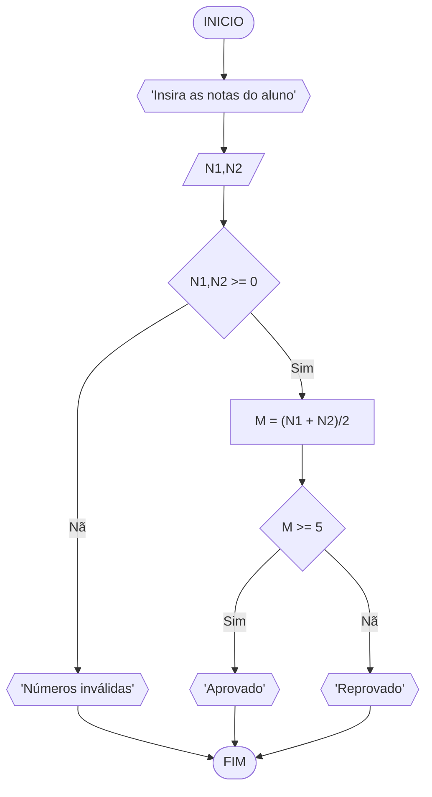
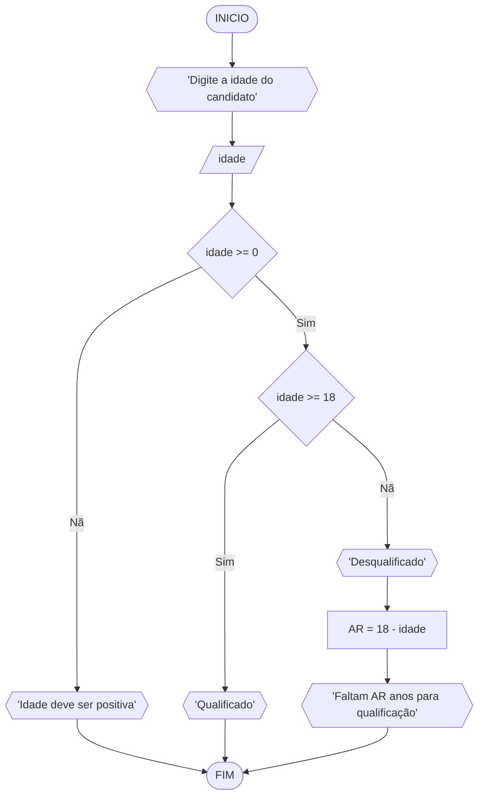

# UNIFOR 
**Nome**: Pedro Lucas Fernandes Moura <br>
**Disciplina**: Raciocínio lógico e algoritmo

## Lista de exercícios 01

## Exercício 02 (3 pontos)
Represente, em fluxograma e pseudocódigo, um algoritmo para calcular o novo salário de um funcionário. 
Sabe-se que os funcionários que recebem atualmente salário de até R$ 500 terão aumento de 20%; os demais terão aumento de 10%.

#### Fluxograma (1.0 ponto)



#### Pseudocódigo (1.0 ponto)

```
1 ALGORITMO ContaAprovacoes
2 DECLARE S, SN
3 ESCREVA "Digite o Salário: "
4 INICIO
5 LEIA S
6 SE S > 0 ENTAO
7  S =< 500 
8  SN == S*1.20
9  ESCREVA "Salário novo é", sn
10  SENAO
11    SN == S*1.10
12    ESCREVA "Salário novo é", SN
13  FIM_SE
14  SENAO
15    ESCREVA "Número inválido"
16  FIM_SE
17  FIM_ALGORITMO
```

#### Teste de mesa (1.0 ponto)

| S | S > 0 | Validez | S >= 500 | SN | 
| -- | -- | -- | -- | -- | 
| 0 | Falso | Número inválido |  --     | -- |
| 100 | Verdade | Número válido | SN = 100*1.2 | 120 |
| 250 | Verdade | Número válido | SN = 250*1.2 | 300 |
| 500 | Verdade | Número válido | SN = 500*1.2 | 600 |
| 600 | Verdade | Número válido | SN = 600*1.1 | 660 |
## Exercício 03 (3 pontos)
Represente, em fluxograma e pseudocódigo, um algoritmo para calcular a média aritmética entre duas notas de um aluno e mostrar sua situação, que pode ser aprovado ou reprovado.

#### Fluxograma (1 ponto)


#### Pseudocódigo (1 ponto)

```
1 Algoritmo ContaAprovacoes
2 DECLARE N1, N2, M
3 ESCREVA "Digite as notas: "
4 INICIO
5 LEIA N1, N2
6 SE N1, N2 >= 0 ENTAO
7  M = (N1 + N2)/2
8  SE M >= 5 ENTAO
9    ESCREVA "Aprovado"
10  SENAO
11    ESCREVA "Reprovado"
12  FIM_SE
13  SENAO
14    ESCREVA "Números inválidos"
15  FIM_SE
16 FIM_ALGORITMO
```

#### Teste de mesa (1 ponto)

| N1,N2 | N1,N2 >= 0 | Validez | M | M >= 5 | Status | 
| -- | -- | -- | -- | -- | -- |
| -1, -2 | Falso | Números inválidos | -- | -- | -- |
| 0,0 | Verdade | Números válidos | 0 | Falso | Reprovado |
| 2, 5 | Verdade | Números válidos | 3.5 | Falso | Reprovado |
| 5, 5 | Verdade | Números válidos | 5 | Verdade | Aprovado |
| 10, 10 | Verdade | Números válidos | 10 | Verdade | Aprovado |
## Exercício 04 (3 pontos)
Represente, em fluxograma e pseudocódigo, um algoritmo que, a partir da idade do candidato(a), determinar se pode ou não tirar a CNH. 
Caso não atender a restrição de idade, calcular quantos anos faltam para o candidato estar apto.

#### Fluxograma (1.0 ponto)

#### Pseudocódigo (1.0 ponto)
```
Algoritmo ContaAprovacoes
DECLARE idade, AR: inteiro 
ESCREVA "Digite a idade: " 
INICIO
LEIA idade
SE idade >= 0 ENTAO
  idade >= 18
  ESCREVA "Qualificado"
  SENAO
    ESCREVA "Desqualificado"
    AR = 18 - idade
    ESCREVA "Anos restantes para candidatura ", AR
  FIM_SE
  SENAO
    ESCREVA "Idade deve ser positiva"
  FIM_SE 
FIM_ALGORITMO
```
#### Teste de mesa (1.0 ponto)

| idade | idade >= 0 | Validez | idade >= 18 | Qualificação | Anos Restantes | 
| -- | -- | -- | -- | -- | -- | 
| -1 | Falso | Idade inválida | -- | -- | -- |
| 0 | Verdade | Idade válida | Falso | Desqualificado | 18 |
| 15 | Verdade | Idade válida | Falso | Desqualificado | 3 |
| 18 | Verdade | Idade válida | Verdade | Qualificado | 0 |
| 21 | Verdade | Idade válida | Verdade | Qualificado | 0 |
