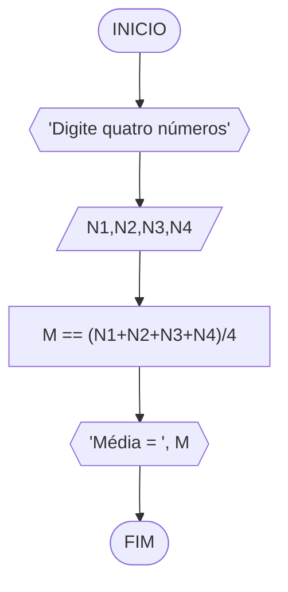
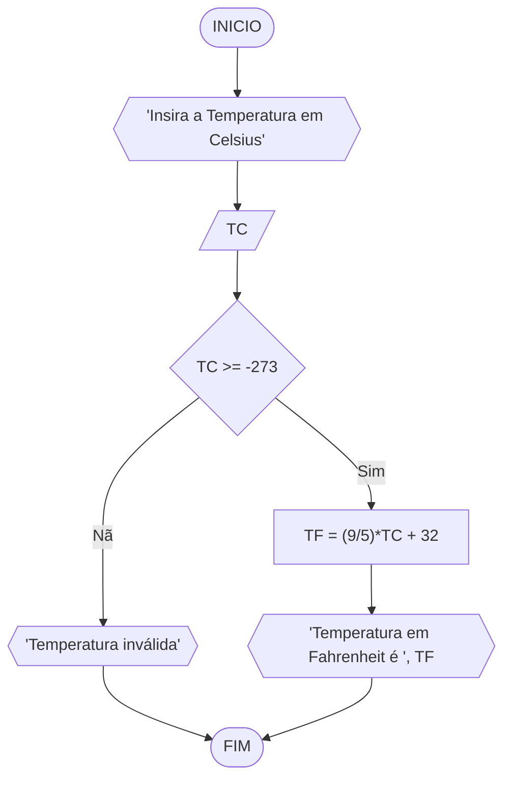
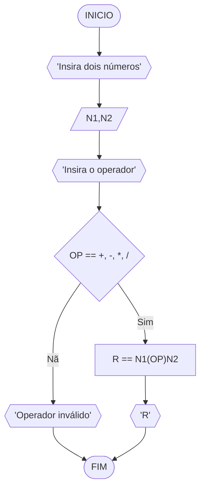
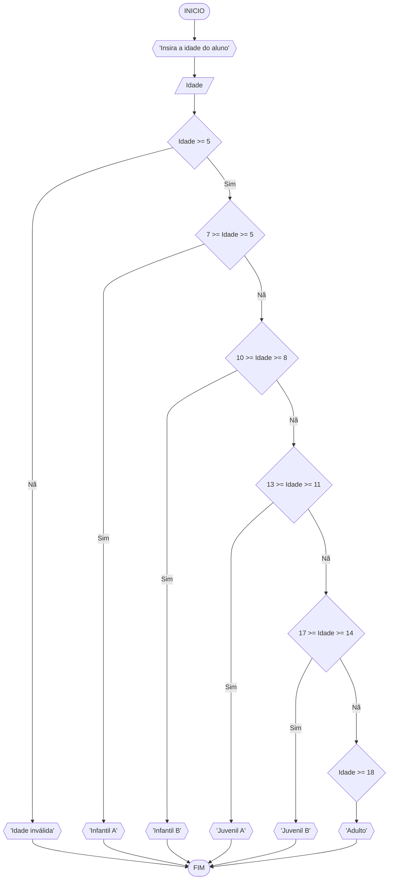

# UNIFOR
**Nome**: Pedro Lucas Fernandes Moura <br>
**Disciplina**: Raciocínio lógico e algoritmo

## Lista de exercícios 02

### Exercício 01 (2.5 pontos)
Calcule a média de quatro números inteiros dados.

#### Fluxograma (1.0 ponto)



#### Pseudocódigo (1.0 ponto)

```
1 ALGORITMO Media
2 DECLARE N1, N2, N3, N4: inteiro, M: real
3 INICIO
4 ESCREVA "Digite quatro números"
5 LEIA N1, N2, N3, N4
6 M == (N1+N2+N3+N4)/4
7 ESCREVA "Média = ", M
8 FIM_ALGORITMO
```

#### Teste de mesa (0.5 ponto)

| N1, N2, N3, N4 | Inteiros | Cálculo | M |   
| -- | -- | -- | -- | -- |
| 0.5, 2.2, 7.5, 9.2  | Falso | (0+2+7+9)/4 | 4.5 |
| 1.1, 2, 3, 4.2  | Falso | (1+2+3+4)/4 | 2.5 | 
| 1, 2, 3, 4  | Verdade | (1+2+3+4)/4 | 2.5 |
| 10, 50, 60, 70 | Verdade | (10+50+60+70)/4 | 47.5 |

### Exercício 02 (2.5 pontos)
Leia uma temperatura dada em Celsius (C) e imprima o equivalente em Fahrenheit (F). (Fórmula de conversão: F = (9/5) * C + 32)

#### Fluxograma (1.0 ponto)



#### Pseudocódigo (1.0 ponto)

```
1 ALGORITMO ConverteCelsiusFarenheit
2 DECLARE TC, TF
3 INICIO
4 ESCREVA "Digite a temperatura em Celsius"
5 LEIA TC
6 SE TC >= -273 ENTAO
7   TF = (9/5)*TC + 32
8   ESCREVA "Temperatura em Fahrenheit é", TF
9 SENAO  
10   ESCREVA "Temperatura inválida" 
11 FIM_SE
12 FIM_ALGORITMO
```

#### Teste de mesa (0.5 ponto)

| TC | TC >= -273 | Validez | TF | 
|      --      |      --      |      --      |      --      |      --      | 
| -300 | Falso | Inválido | -- |
| -273 | Verdade | Válido | -459,4 |  |
| 0 | Verdade | Válido | 32 |  |
| 180 | Verdade | Válido | 212 |  |

### Exercício 03 (2.5 pontos)
Receba dois números reais e um operador e efetue a operação correspondente com os valores recebidos (operandos). 
O algoritmo deve retornar o resultado da operação selecionada simulando todas as operações de uma calculadora simples.

#### Fluxograma (1.0 ponto)



#### Pseudocódigo (1.0 ponto)

```
1 ALGORITMO Calculadora
2 DECLARE N1, N2, Resultado: real, Operador: (+, -, *, /)
3 INICIO
4 ESCREVA "Digite dois números"
5 LEIA N1, N2
6 ESCREVA "Digite o operador"
7 ESCOLHA
8   CASO Operador == +
9   Resultado == N1+N2
10  ESCREVA Resultado
11  CASO Operador == -
12  Resultado == N1-N2
13  ESCREVA Resultado
14  CASO Operador == *
15  Resultado == N1*N2
16  ESCREVA Resultado
17  CASO Operador == /
18  Resultado == N1/N2
19  ESCREVA Resultado
20  SENAO
21  ESCREVA "Operador inválido"  
22 FIM_ESCOLHA
23 FIM_ALGORITMO
```

#### Teste de mesa (0.5 ponto)

| N1 | N2 | Operador | Validez | Resultado | 
|      --      |      --      |      --      |      --      |      --      | 
| 0 | 0 | 1 | Falso | -- |
| 1 | 1 | + | Verdade | 2 |
| 3 | 3 | * | Verdade | 9 |
| -22 | -3 | - | Verdade | -19 |

### Exercício 04 (2.5 pontos)
Elaborar um algoritmo que, dada a idade, classifique nas categorias: infantil A (5 - 7 anos), infantil B (8 -10 anos), juvenil A (11 - 13 anos), juvenil B (14 -17 anos) e adulto (maiores que 18 anos).

#### Fluxograma (1.0 ponto)



#### Pseudocódigo (1.0 ponto)

```
1 Algoritmo ClassificaCategoria
2 DECLARE Idade: inteiro
3 INICIO
4 ESCREVA "Insira a idade do aluno"
5 ESCOLHA
6  CASO 7 >= Idade >= 5
7    ESCREVA "Infantil A"
8  CASO 10 >= Idade >= 8
9    ESCREVA "Infantil B"
10  CASO 13 >= Idade >= 11
11    ESCREVA "Juvenil A"
12  CASO 17 >= Idade >= 14
13    ESCREVA "Juvenil B"
14  CASO Idade >= 18
15    ESCREVA "Adulto"
16  SENAO
17    ESCREVA "Idade inválida"
18 FIM_ESCOLHA
19 FIM_ALGORITMO 
```

#### Teste de mesa (0.5 ponto)

| Idade | Validez | Categoria | 
| -- | -- | -- | -- | -- | 
| -22 | Falso | -- |  |  |
| 3 | Falso | -- |  |  |
| 13 | Verdade | Juvenil A |  |  |
| 21 | Verdade | Adulto |  |  |
