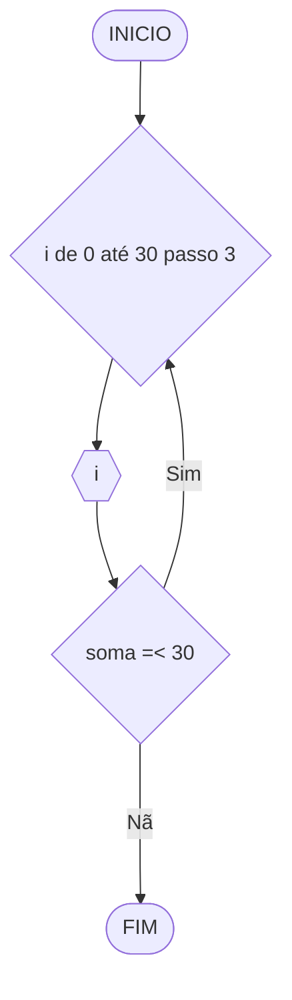

# UNIFOR
**Nome**: Pedro Lucas Fernandes Moura <br>
**Disciplina**: Raciocínio lógico e algoritmo

## Exercício exemplo 1
Implemente e teste um programa que imprima os n primeiros números.

#### Fluxograma


#### Pseudocódigo
```
1 ALGORITMO print_n_primeiros
2 DECLARE n, num: INTEIRO
3 INICIO
4 ESCREVA “Digite um número: ”
4 LEIA n			// variável de entrada n
4 num ← 1			// variável num inicializada
5 ENQUANTO num <= n FAÇA	// n iterações
7	ESCREVA “Número ”, num
8	num ← num + 1		// num =+ 1 (incremento)
8 FIM_ENQUANTO
9 FIM
```

#### Teste de mesa
| it | n  | num | num <= n | Saída      | num =+ 1 |
| -- | -- | --  | --       | --         | --       |
| 1  | 10 | 1   | True     | Número 1   | 2        |
| 2  | 10 | 2   | True     | Número 2   | 3        |
| 3  | 10 | 3   | True     | Número 3   | 4        |
| 4  | 10 | 4   | True     | Número 4   | 5        |
| 5  | 10 | 5   | True     | Número 5   | 6        |
| 6  | 10 | 6   | True     | Número 6   | 7        |
| 7  | 10 | 7   | True     | Número 7   | 8        |
| 8  | 10 | 8   | True     | Número 8   | 9        |
| 9  | 10 | 9   | True     | Número 9   | 10       |
| 10 | 10 | 11  | True     | Número 10  | 11       |
| 11 | 10 | 11  | False    |            |          |

## Exercício exemplo 2
Implemente e teste um programa que some os n primeiros números.

#### Fluxograma


#### Pseudocódigo
```
1  ALGORITMO	soma_n_numeros()
2  DECLARE	n, i, soma: INTEIRO
3  INICIO
4  ESCREVA “Digite a quantidade de números: ”
5  LEIA n		// variável de entrada n
7  soma ← 0		// variável soma inicializada
6  PARA i DE 1 ATÉ n PASSO 1 FAÇA
7	soma ← soma + i	// soma =+ i (incremento)
8  FIM_PARA
9  ESCREVA “A soma é igual a ”, soma
10 FIM
```

#### Teste de mesa
| it | n  | soma | i  | soma =+ i |
| -- | -- | --   | -- | --        |
| 1  | 10 | 0    | 1  | 1         |
| 2  | 10 | 1    | 2  | 3         |
| 3  | 10 | 3    | 3  | 6         |
| 4  | 10 | 6    | 4  | 10        |
| 5  | 10 | 10   | 5  | 15        |
| 6  | 10 | 15   | 6  | 21        |
| 7  | 10 | 21   | 7  | 28        |
| 8  | 10 | 28   | 8  | 36        |
| 9  | 10 | 36   | 9  | 45        |
| 10 | 10 | 45   | 10 | 55        | 

## Lista de exercícios 03

### Exercício 01 (2.5 pontos)
Atualize o algoritmo para determinar se um número inteiro e positivo é par ou ímpar, usando uma laço condicional para aceitar apenas números maiores ou iguais a zero. 

#### Fluxograma (1.0 ponto)


#### Pseudocódigo (1.0 ponto)

```
1 ALGORITMO ClassificaCategoria
2 DECLARE N, Res: inteiro
3 INICIO
4 ESCREVA "Digite um número"
5 LEIA N
6 ESCOLHA 
7   CASO N >= 0 Res <-- N % 2
8   SE Res <-- 0 ENTAO
9     ESCREVA "Par"
10  SENAO
11    ESCREVA "Impar"
12  FIM_SE
13 SENAO
14 REPITA
15   ESCREVA "Número deve ser positivo"
16   ESCREVA "Digite um número"
17   LEIA N
18 ATE QUE N >= 0
19 FIM_ESCOLHA   
20 FIM_ALGORITMO
```

#### Teste de mesa (0.5 ponto)

| Número | Validez | Resto | Resto == 0 | Classificação | 
|      --      |      --      | -- |      --      |      --      | 
| -2 | Falso | -- | -- | Número deve ser positivo |
| 0 | Verdade  | 0 | Verdade | Par |
| 2 | Verdade | 0 | Verdade | Par |
| 5 | Verdade | 1 | Falso | Impar |

### Exercício 02 (2.5 pontos)
Faça um algoritmo que exiba na tela uma contagem de 0 até 30, exibindo apenas os múltiplos de 3.

#### Fluxograma (1.0 ponto)



#### Pseudocódigo (1.0 ponto)

```
1 ALGORITMO ClassificaCategoria
2 DECLARE i: inteiro
3 INICIO
4 PARA i DE 0 ATE 30 PASSO 3 FAÇA
5   ESCREVA i
6 FIM_PARA
7 FIM_ALGORITMO
```

#### Teste de mesa (0.5 ponto)

| i | Passo 3 | i =< 30 |
| -- | -- | -- | -- | -- | 
| 0 | 3 | Verdade | 
| 6 | 9 | Verdade |.
| 15 | 18 | Verdade |.
| 30 | 33 | Falso |.
### Exercício 03 (2.5 pontos)
Dada uma sequência de números inteiros, calcular a sua soma. 
Por exemplo, para a sequência {12, 17, 4, -6, 8, 0}, o seu programa deve escrever o número 35.

#### Fluxograma (1.0 ponto)


#### Pseudocódigo (1.0 ponto)

```
1 ALGORITMO ClassificaCategoria
2 DECLARE N, Total: inteiro
3 INICIO
4 Total <-- 0
5 ENQUANTO Total != 35 FAÇA
6   ESCREVA "Digite um número"
7   LEIA N
8   Total <-- Total + N
9 FIM_ENQUANTO
10 FIM_ALGORITMO
```

#### Teste de mesa (0.5 ponto)

| Total | N | Total + N | Total != 35|
| -- | -- | -- | -- | -- | 
| 0 | 5 | 5 | Verdade |  |
| 32 | 3 | 35 | Falso |  |
| 17 | 27 | 44 | Verdade |  |
| 37 | -2 | 35 | Falso |  |

### Exercício 04 (2.5 pontos)
Escreva um programa que leia a nota de diversos alunos, até que seja digitada uma nota negativa. 
Nesse momento, ele mostra a média aritmética de todas as notas lidas e quantas notas foram lidas. 
Ex. Foram lidas 14 notas. A média aritmética é 6.75!

#### Fluxograma (1.0 ponto)


#### Pseudocódigo (1.0 ponto)

```
1 ALGORITMO ClassificaCategoria
2 DECLARE Nota, soma, notas, media
3 INICIO
4 soma == 0
5 notas == 0
6 ENQUANTO 10 >= Nota > 5 FAÇA
7   ESCREVA "Digite uma nota"
8   LEIA Nota
9   soma =+Nota
10   notas =+1
11 FIM_ENQUANTO
12 media == soma/notas
13 ESCREVA "Foram lidas ", notas, " notas", "A média aritmética é ", media
14 FIM_ALGORITMO
```

#### Teste de mesa (0.5 ponto)

| Nota | 10 >= Nota > 5 | soma | soma =+Nota | notas | notas =+1| media == soma/notas |  
| -- | -- | -- | -- | -- | -- | -- |
| 6 | Verdade | 6 | 12 | 1 | 2 | 6 |
| 8 | Verdade | 32 | 40 | 5 | 6 | 6.66 |
| 9 | Verdade | 0 | 9 | 0 | 1 | 9 |
| 4 | Falso | 102 | -- | 14 | -- | 7.28|
